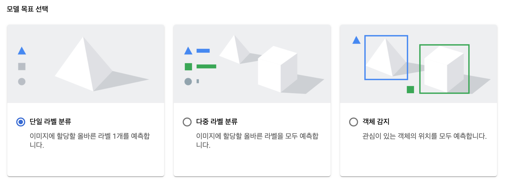

# AutoML Vision

AutoML Vision 은 AutoML 시리즈중에서 제일 먼저 도입된 제품입니다.
처음의 모습은 지금과 조금 달랐지만, 아직은 초기의 모습을 거의 간직하고 있습니다.

우선 AutoML의 전반적인 특징부터 보겠습니다.
AutoML은 처음 AutoML Vision 이 출시된 이후로 현재까지 다양한 제품들이 나왔지만, 공통적으로는 "ML을 전혀 모르는 사람도 데이터를 넣어주기만 하면 스스로 학습한다."라는 컨셉은 동일합니다.
AutoML Vision의 경우에는 크게 2가지 서비스가 있습니다.

하나는 이미지 분류와 다른 하나는 객체 감지입니다.
이미지 분류는 개별적으로 라벨링이 된 이미지들을 넣어주면 그것을 학습해서 새로운 이미지를 받았을때 어느 라벨에 해당하는지를 판별해주는 서비스입니다.
이미지 분류에서도 크게 2가지로 나뉘는데 하나는 단일 라벨 분류이고, 다른 하나는 다중 라벨 분류입니다.
단일 라벨 분류는 이미지에 하나의 라벨을 할당하며 결과적으로는 묶음 형태로 이해하면 됩니다.
다중 라벨 분류는 하나의 이미지에 해당하는 라벨을 분류할때 사용하는데, 예를들면 하나의 이미지를 놓고 빨간색이 많은 이미지와 삼각형을 구분하는 정도로 이해하면 됩니다.
그리고 객체 감지는 이미지에 있는 객체를 감지하는 것인데 아래의 이미지를 참조하면 쉽게 이해가 될것입니다.

객체 감지는 사전에 다량의 이미지에 영역을 라벨링을 해주고 해당 데이터를 업로드 해주면 학습되는것을 의미합니다.
예를들면 라벨분류를 하려고 할때 복잡한 이미지에서 한번에 해당 이미지를 찾아서 라벨링을 학습하도록 하는것이 어려울 경우 사전에 객체 감지를 통해서 1차 적으로 분류를 하고, 그 다음에 2차 적으로 라벨 분류를 하면 상대적으로 우수한 결과물을 얻을 수 있습니다.
